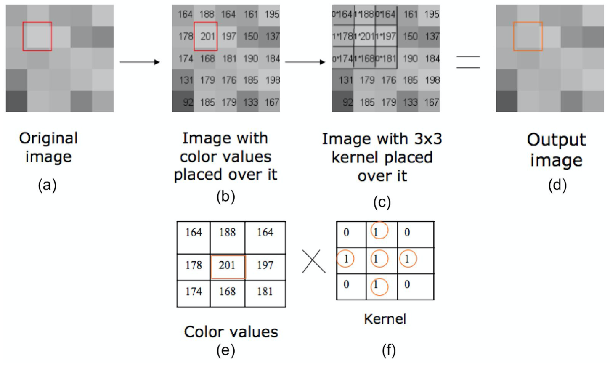

#  Convolution
Download the Github repo here.

## Prologue

The purpose of today's lab is to introduce you to image processing which will help you prepare for our next project, **Filter**, where you will create slightly more complicated filters than the ones we will introduce here. 

In this lab, you will learn about kernels and convolutions and how they can be applied to images to produce different image processing effects. 

Lets get started!

## Intro

Digital image processing is a field in which certain operations are performed on digital images in order to enhance or extract useful information from them. It's a type of **signal processing** in which our inputs are two-dimensional signals, i.e. images! Unlike sound processing, which measures sound signals over one-dimensional time, image processing measures signals over two-dimensional space.

Image processing algorithms cover a wide range of applications, including the conversion of signals from analog sensors to digital images, removing noise artifacts, extracting semantic information, image compression, and image enhancement.

An image can be defined mathematically by the function f(x, y) where x and y correspond to the horizontal and vertical axes, respectively. The value of the function at a certain point provides the color of the pixel defined at that particular set of coordinates. This 2D matrix of pixels represents the image spatial domain. This information may be transformed into another domain that you may have heard of in class: the frequency domain, which is obtained by applying a Fourier Transformation on an image that is currently in the spatial domain. 

In this lab, we will solely be working in the spatial domain.  

## Filter Set-Up

The `Canvas2D` class will be responsible for storing and manipulating the 2-dimensional canvas that will be displayed by the application window. This class has a `filterImage()` function that will be called by `MainWindow` whenever the filter button is clicked.

Let’s set-up the `filterImage()` function to apply the appropriate effect when the filter button is clicked.

Take a look at filter functions at [location]

These functions are used to do specific operations on images.
1. `[function]` Turns the image from a colorful to grayscale
2. `[function]` Moves the image to the right
3. `[function]` Scales the image up or down

|**_Task:_**|
|:---|
|<ol><li>Use the information in the global `Settings` object in order to figure out what specific filter will be applied to the image.</li><li>Head over to `Settings.h` to see the enumeration that contains all filter type names.</li><ul><li>Reminder that enums can be accessed by `EnumName::EnumValue`</li></ul><li>In `Canvas2D`, call the appropriate functions when different EnumValue are passed.</li><ul><li>Note that `FilterShift` takes in an additional argument, `ShiftDirection`</li><li>*Tip: Use a switch statement to keep the code clean and readable!*</li></ul></ol>|

## Grayscale Filter

The first filter we will apply is a grayscale effect. 

In this filter, we do not have to use convolution because the value of each pixel after processing is only relevant to its own value before processing. However, it is a fun exercise on how to process pixels on your canvas.

In image processing, a grayscale image is one in which each pixel stores a single value that represents the amount of light passing through that point. In other words, the pixels only carry **intensity** information. These images are usually gray because each channel (RGB) is set to the same value. Black (i.e. zero) signifies the weakest light intensity, and white (i.e. 255, since we have 8 bits per channel to store the sampled pixel data) represents the strongest light intensity. 

This isn't the only way to do grayscale as we can create various grayscale effects that enhance different information about an image with different algorithms, but this is the most standard application and the one that we will start with.

|**_Task:_**|
|:---|
|<ol><li>Head over to the FilterGray function.</li><li>Make a call to the `RGBAToGray()` and store the gray `unsigned char` value that represents the light intensity at `current_pixel`.</li><ul><li>We will use the `RGBAToGray()` method in order to calculate the appropriate shade of gray that represents the intensity of the pixel. This function will map the pixel’s three RGB values to a single light intensity value.</li></ul><li>Set the final color of the pixel using the value `RGBAToGray()` returns.</li></ol>|

|**_Task:_**|
|:---|
|<ol><li>Return the correct gray value by computing a weighted sum of the R, G and B components of the incoming pixel.</li><ul><li>Make sure that the image does not keep getting darker as you apply the grayscale filter.</li></ul></ol>|
|

About mapping RGB values to a single gray intensity
<ul><li>The method to map RGB values to a the single gray intensity is not unique. For example, the simple *average method* computes the average between the three color channels: Y = (R + G + B) / 3</li><li>The *lightness method*, which will desaturate the image, averages the least prominent and most prominent values:<ul><li>Y = ( MAX(R,G,B) + MIN(R,G,B) ) / 2</li></ul></li><li>The *luminosity method* calculates a weighted sum between the three color channels using percentages that account for the human perceptual system (we recommend this!)<ul><li>Y = 0.299*R + 0.587*G + 0.114*B</li></ul></li></ul>
|

<!---
**Task:** 
Return the correct gray value by computing a weighted sum of the R, G and B components of the incoming pixel.
- Make sure that the image does not keep getting darker as you apply the grayscale filter.

  DROPDOWN：
- The method to map RGB values to a the single gray intensity is not unique. For example, the simple *average method* computes the average between the three color channels: Y = (R + G + B) / 3
- The *lightness method*, which will desaturate the image, averages the least prominent and most prominent values: Y = ( MAX(R,G,B) + MIN(R,G,B) ) / 2
- The *luminosity method* calculates a weighted sum between the three color channels using percentages that account for the human perceptual system (we recommend this!)
  Y = 0.299*R + 0.587*G + 0.114*B
-->

**Task:** 

Set the final color of the pixel using the value `RGBAToGray()` returns.

- Update the pixel, which is referenced by the `current_pixel` pointer. Remember to set all three color channels individually by accessing them from `current_pixel` directly!

## Invert Filter

It only takes a little more effort to implement an invert image filter. It is also known as the negative effect, this method works by inverting the value of each color channel for a pixel. In order to invert a channel, we subtract its value from the maximum color value, which in this case is 255.

**Task:** 

In the`FilterInvert()` function,

- Invert each color channel of `current_pixel`.

*Tip: If you take the inversion of the inverted pixel data, you should end up with the original image! Test this out by simply double-filtering an image with the invert filter.*

## Convolution

Up until now, we have written filters that deal with each pixel independently, i.e. the final color of a specific pixel in the grayscale and inverse filters did not depend on neighboring pixels. We will now introduce the concept of **convolution**, which allows us to apply operations to a pixel while taking into account information obtained from its neighbors in the spatial domain.

Convolution is one of the most fundamental operations in image processing. It can be used to alter images, as well as extract information from them (for this reason, it is used for dataset analysis in convolutional neural networks). The convolution operation relies on the use of **kernels**, which are two-dimensional matrices of varying dimensions.

Let’s look at the example below. For simplicity, let us represent our image data with only one color channel, as shown in (b). We will apply the kernel to the pixel highlighted in red, which contains the intensity value **201**. Our kernel, shown in (f) is a 3x3 matrix. In image (c), we place the kernel over the pixel and multiply each kernel value with the corresponding neighboring pixels that surround our red-highlighted pixel.

To obtain the final value that will be used to update the pixel of interest (i.e. the pixel with intensity **201**), we will add up all of the multiplications in image (c) to obtain a final value of

(0 * 164) + (1 * 188) + (1 * 178) + (1 * 201) + (1 * 197) + (0 * 174) + (1 * 168) + (1 * 181) = 932

Before updating the pixel with this value, we must divide by the sum of the kernel coefficients to preserve overall brightness. The final value will be: 932/5 = 186.4

As you can probably guess, convolution in two dimensions is very expensive to perform due to the rapid accumulation of multiplication operations when kernel dimensions become large. However, if the kernel is **separable**, then the computation can be reduced to *M* + *N* multiplications. You will need to implement separable kernels for at least one filter in the upcoming filter assignment. For this lab, we will only cover convolution with 2D kernels.

*Tip: Since convolution becomes very inefficient with large images, we recommend you use small to medium-sized data for testing.*

We will now fill in the `Convolve2D()` method in the `FilterUtils` namespace. We need to store the new image data in a different `RGBA` array so as to not overwrite the original pixel data during the convolution process.

**Task:**

- Initialize a `result` array to store the new `RGBA` values, using the incoming image `width` and `height`.

**Task:**

In order to iterate through the kernel, we will need its width and height,

- Obtain the dimensions of `kernel` and initialize it at the beginning of the convolve function

  - Since we can get `kernel.size()`, use a math function to determine the dimensions (refer to the tip below). We included `math.h` for you!

*Tip: Two dimensional kernels will usually be square matrices since they tend to be symmetric in practice, so you can assume that the width and height are equal in this implementation. You can also assume that the width and height are always odd, since the kernel must be centered around one pixel.*

**Task:**

The final pixel color will be the summation of the kernel applied to the current pixel as well as its neighbors.

- Initialize `red_acc`, `green_acc`, and `blue_acc` *float* variables to store the accumulated color channels.

- Recall that `RGBA` stores channel information as integers. The kernel however, is defined by floats. You will need to convert the pixel data to a float before applying the kernel’s value to it.

**Task:**

We will now apply the convolution kernel on every pixel as we iterate over the image data.

- Iterate over the kernel by creating a nested for-loop using the kernel dimension calculated in the previous tasks.

- You will need two values at each iteration of the for-loop: the current value of the kernel and the value of the pixel that corresponds to that kernel element.

- - Update `red_acc`, `green_acc`, and `blue_acc` with the corresponding pixel value multiplied by the value of the kernel at that for-loop iteration.

*Tip: The index of the current kernel element can be obtained by using the current kernel row, current kernel column and kernel width. The index of the current pixel can be obtained similarly; however, you will need to perform additional steps in order to find the current row and column of the image that pertain to that kernel index.*

**Task:**

You may have noticed an issue when applying kernels with width and height greater than 1: the kernel extends beyond the boundary of the image, where pixel data is not defined. There are several ways to deal with these edge cases:

In [Locations], we give you some functions that can be used to deal with pixels outside the boundary of the image:

**a) getPixelReplicated(i, j)**

[diagram]

[outcome]

**b) getPixelReflected(i, j)**

[diagram]

[outcome]

**c) getPixelWrapped(i, j)**

[diagram]

[outcome]

**Task**：

We have implemented function  a and c for you, and you are welcome to apply them to your code.

We ask that you try to implement function b and apply it to your code too. How are your outcomes different?

**Task:**

Update the `result` array at the center pixel index.

- Create a `RGBA` variable with the `red_acc`, `green_acc`, and `blue_acc` floats that have been accumulated.

- Use the `REAL2byte()` utility function that has been provided to convert the float back to an integer between 0 and 255.

- During the convolution process, one must divide the accumulated intensity by the sum of the kernel coefficients in order to preserve overall brightness. We will ignore this for now since our Identity and Shift filters do not risk increasing image brightness; however, you will need to take this into account for your Filter project.

**Task:**

Copy the `result` array to the canvas image data.

- Use `memcpy()` values to transfer the data from the `result` buffer array to the canvas image data.

- The first argument to this function is the destination, while the second argument is the source. The function also requires a third argument, the number of bytes to copy. You will need to obtain this value by using the canvas dimensions, as well as the size of the data type that we use to store the image color intensities.

*Tip: The C++ keyword `sizeOf()` returns the size in bytes of a given data type*

## Identity Filter

Kernels are the key deciding what your convolution operation does to images.

Different kernels are predefined and stored in [location], to make identity filter and shift filter work, you will need modify the kernels used in these operations.

The identity filter will perform the convolution using an identity kernel, i.e. a kernel that, once convolution has been performed, results in the original image.

### Task 13

We will need the identity filter to use 2D convolution to filter the canvas data that is sent from `Canvas2D` when the filter button is clicked,

- In the function  `FilterIdentity()` , call `Convolve2D()` from the `FilterUtils` namespace, sending the appropriate canvas information.

### Task 14

The `Convolve2D()` method in `FilterUtils` takes in a kernel that will be used during the convolution process. We will need to initialize it for the identity filter.

- In the `FilterIdentity` initializer list, initialize `m_kernel` to be a vector of floats.
- The size of the vector may be any odd number; however, remember that once the kernel size gets too large, 2D convolution becomes very slow.

## Shift Filter

The shift filter will shift the image one pixel to the left or right, depending on the value of `m_shiftDir`.

**Task:**

- In the `apply()` method of the `FilterShift` class, call `Convolve2D()` from the `FilterUtils` namespace, sending the appropriate canvas information.

**Task:**

Now we will need to initialize `m_kernel` for the shift filter.

- In shift filter initializer list, initialize `m_kernel` to be a vector of floats.

- Use the `m_shiftDir` variable to check whether the filter being used is a shift right or shift left filter.

- Depending on the value of this `m_shiftDir` variable, create the appropriate kernel to shift the image *by one pixel*.

## End

Now you are ready to show your program to a TA to get checked off!

Be prepared to answer one or more of the following:

- What do the pixel values in a grayscale image represent?

- Describe the process of convolving an image with a kernel.

- What happens when the kernel exceeds the boundary of an image?

- Provide a kernel to shift an image three pixels downwards.

- Provide a kernel to shift an image five pixels upwards.
